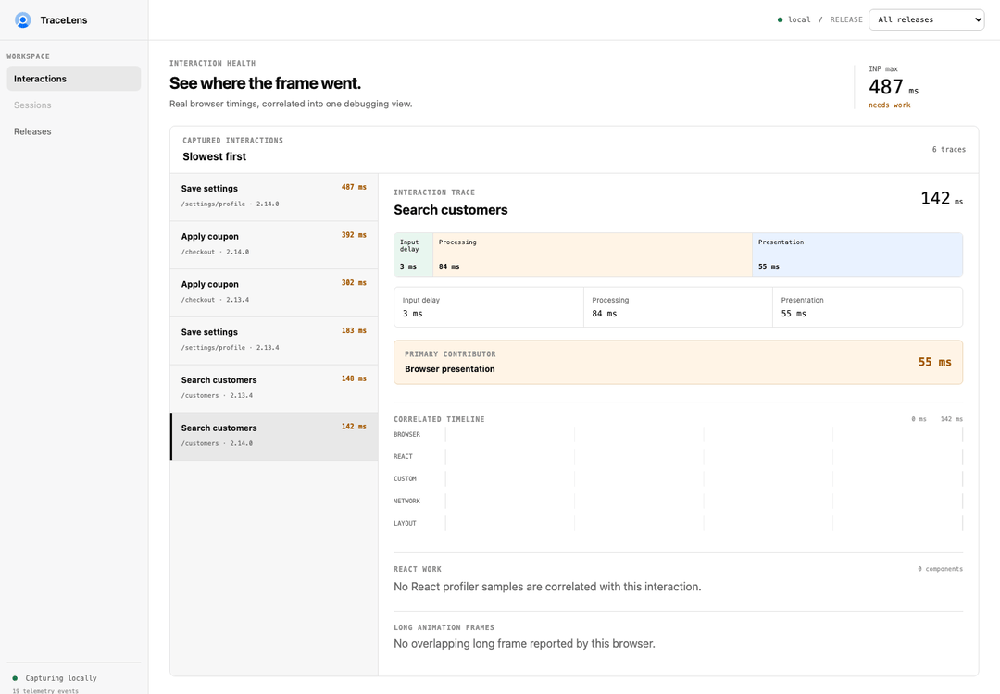
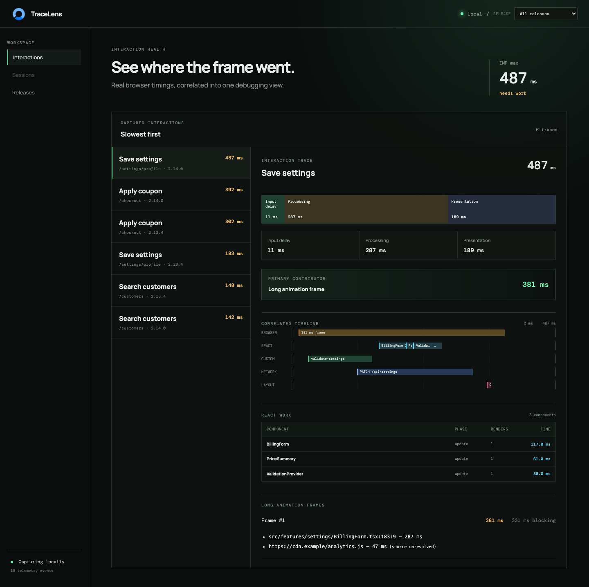
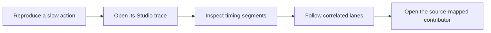
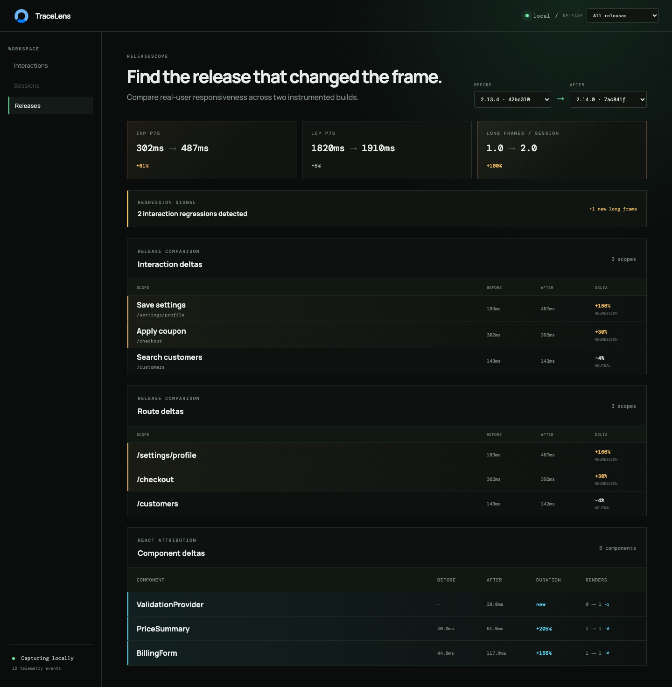
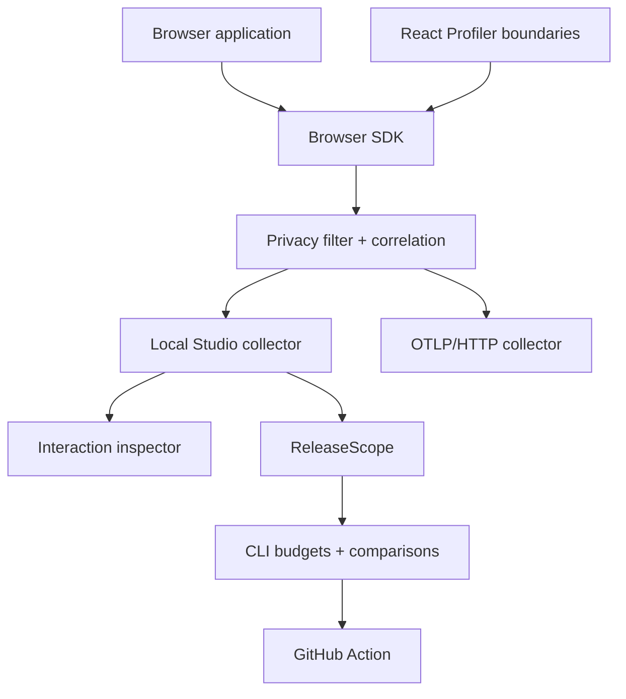

<p align="center">
  <a href="https://leracherry.github.io/tracelens/">
    
  </a>
</p>

<h1 align="center">TraceLens</h1>

<p align="center">
  <strong>Real-user performance debugging for frontend engineers.</strong><br />
  Find the interaction. Find the frame. Find the component. Find the release.
</p>

<p align="center">
  <a href="https://github.com/leracherry/tracelens/actions/workflows/ci.yml"></a>
  <a href="https://www.npmjs.com/package/@leracherry/tracelens-browser"></a>
  <a href="https://github.com/leracherry/tracelens/releases"></a>
  <a href="https://leracherry.github.io/tracelens/"></a>
  <a href="LICENSE"></a>
</p>

<p align="center">
  <a href="#quick-start">Quick start</a> ·
  <a href="https://leracherry.github.io/tracelens/">Documentation</a> ·
  <a href="#workflows">Workflows</a> ·
  <a href="#packages">Packages</a> ·
  <a href="CONTRIBUTING.md">Contributing</a>
</p>

<p align="center">
  
</p>

TraceLens turns browser telemetry into an explanation. Start with a slow interaction, follow the browser, React, network, layout, and custom work that overlapped it, map expensive scripts back to source, and compare the same signal across releases.

> [!IMPORTANT]
> TraceLens is a local-first debugging toolkit—not a hosted RUM backend. Studio binds to loopback, keeps telemetry in bounded memory, and requires no account.

## Why TraceLens

| A metric tells you…                  | TraceLens helps you answer…                                |
| ------------------------------------ | ---------------------------------------------------------- |
| INP p75 is 487 ms                    | Which interaction produced it?                             |
| Main-thread work was high            | Which long frame and script consumed the time?             |
| React committed during the delay     | Which profiled boundary rendered, how long, and how often? |
| A request overlapped the interaction | Which sanitized fetch or XHR call was involved?            |
| Performance changed                  | Which release, route, interaction, or component regressed? |

## Quick start

Requires Node.js 22 or newer.

<details open>
<summary><strong>1. Start Studio</strong></summary>

```bash
npx @leracherry/tracelens-cli@1.0.0 studio
```

Studio opens at <http://127.0.0.1:4173> and exposes a loopback-only collector at `/__tracelens`.

</details>

<details open>
<summary><strong>2. Instrument the browser</strong></summary>

```bash
npm install @leracherry/tracelens-browser
```

```ts
import { init } from '@leracherry/tracelens-browser';

const stopTraceLens = init({
  app: 'checkout',
  release: '1.0.0',
  environment: 'development',
  endpoint: 'http://127.0.0.1:4173/__tracelens',
});

// Flush queued telemetry and restore patched browser APIs.
await stopTraceLens();
```

</details>

<details open>
<summary><strong>3. Name important work</strong></summary>

```html
<button data-tracelens-name="Save settings">Save</button>
```

```ts
import { trace } from '@leracherry/tracelens-browser';

await trace('validate-settings', async () => {
  await validateSettings();
});
```

Click the control, then select the newest interaction in Studio.

</details>

Follow the complete [five-minute setup](docs/guides/getting-started.md), or open the [Vanilla](examples/vanilla/README.md) and [React + Vite](examples/react-vite/README.md) examples.

## What gets correlated

| Signal                 | What TraceLens records                                                        | Where it appears                   |
| ---------------------- | ----------------------------------------------------------------------------- | ---------------------------------- |
| Event Timing           | Input delay, processing, presentation, route, accessible interaction name     | Interaction summary and timing bar |
| Long Animation Frames  | Duration, blocking time, script attribution, first/third-party classification | Browser lane and frame explorer    |
| React Profiler         | Boundary, phase, actual/base duration, render count                           | React lane and component table     |
| Fetch and XHR          | Method, sanitized URL, status, duration                                       | Network lane                       |
| Layout Shift           | Score, recency, interaction correlation                                       | Layout lane                        |
| Custom spans and marks | Named application work                                                        | Custom lane and exported traces    |
| Build metadata         | Release, commit, environment, build timestamp                                 | Release selector and ReleaseScope  |



<p align="center"><sub>One interaction, from input delay to its source-mapped long-frame contributor.</sub></p>

## Workflows

### Debug one interaction locally



### Find a release regression

ReleaseScope compares p75 values across captured builds and ranks the interaction, route, and React component deltas that changed most.



```bash
npx @leracherry/tracelens-cli compare 2.13.4 2.14.0 --file trace.json
```

### Enforce production budgets in pull requests

```yaml
name: Performance budget
on: [pull_request]

permissions:
  contents: read
  checks: write
  pull-requests: write

jobs:
  tracelens:
    runs-on: ubuntu-latest
    steps:
      - uses: actions/checkout@v7
      - uses: leracherry/tracelens@v1.0.0
        with:
          trace-file: artifacts/tracelens-events.json
          github-token: ${{ secrets.GITHUB_TOKEN }}
```

The Action publishes a job summary, JSON artifact, GitHub Check, and one continuously updated pull-request comment. See the [complete CI workflow](examples/github-action/performance-budget.yml) and [Action guide](docs/guides/github-action.md).

### Export to OpenTelemetry

```ts
import { init } from '@leracherry/tracelens-browser';
import { createTraceLensExporter } from '@leracherry/tracelens-otel';

init({
  app: 'checkout',
  transport: createTraceLensExporter({
    endpoint: 'http://localhost:4318/v1/traces',
  }),
});
```

TraceLens emits OTLP/HTTP JSON spans with resource, release, interaction, HTTP, React, and timing attributes. Use the [collector example](examples/otel/collector.yaml) and [OTel guide](docs/guides/opentelemetry.md).

## CLI

```text
tracelens studio                       Start the local collector and UI
tracelens inspect trace.json           Explain the slowest interaction
tracelens compare BEFORE AFTER         Compare two captured releases
tracelens doctor                       Audit local instrumentation setup
tracelens privacy audit                Find risky telemetry values
tracelens sourcemaps upload ./dist     Import maps into the local store
tracelens budget check                 Evaluate release and route budgets
```

Run `npx @leracherry/tracelens-cli --help` or open the [CLI reference](docs/reference/cli.md) for every option and exit-code contract.

## Architecture



The event protocol is versioned and storage-independent. Read the [architecture overview](docs/architecture/overview.md) and [interaction-correlation design](docs/architecture/interaction-correlation.md).

## Packages

| Package                                                           | Purpose                                                        |
| ----------------------------------------------------------------- | -------------------------------------------------------------- |
| [`@leracherry/tracelens-browser`](packages/browser)               | Browser instrumentation, correlation, privacy, and transports  |
| [`@leracherry/tracelens-react`](packages/react)                   | React Profiler integration and explicit boundaries             |
| [`@leracherry/tracelens-vite`](packages/vite)                     | Release, commit, environment, and build metadata injection     |
| [`@leracherry/tracelens-cli`](packages/cli)                       | Bundled Studio, reports, diagnostics, source maps, and budgets |
| [`@leracherry/tracelens-protocol`](packages/protocol)             | Versioned telemetry types and runtime validation               |
| [`@leracherry/tracelens-core`](packages/core)                     | Queries, release aggregation, diffs, and source resolution     |
| [`@leracherry/tracelens-storage-memory`](packages/storage-memory) | In-memory storage adapter                                      |
| [`@leracherry/tracelens-storage-file`](packages/storage-file)     | Local JSON storage adapter                                     |
| [`@leracherry/tracelens-otel`](packages/otel)                     | TraceLens-to-OTLP mapping and HTTP export                      |

All packages are published to [npm](https://www.npmjs.com/search?q=%40leracherry%2Ftracelens) and mirrored to [GitHub Packages](https://github.com/leracherry/tracelens/packages). Keep package versions aligned.

## Privacy and operational boundaries

TraceLens excludes input values, DOM text, request bodies, and headers. It removes URL credentials, query strings, fragments, and email-shaped path segments by default. Element IDs and `aria-label` values require opt-in.

> [!WARNING]
> Default redaction is not anonymization. Application-provided span names, release metadata, and URL path segments can still contain sensitive values. Audit synthetic telemetry before production rollout.

Studio is an unauthenticated development tool. It binds to loopback, accepts browser requests only from loopback origins, keeps at most 50,000 events in memory, and should never be exposed through a public proxy.

Read the [privacy model](docs/guides/privacy.md), [delivery lifecycle](docs/guides/reliability.md), and [browser support and overhead](docs/guides/browser-testing-overhead.md).

## Browser support and limits

- Core instrumentation degrades safely when a Performance API is unavailable.
- Event Timing and Long Animation Frames are most complete in Chromium-based browsers.
- React production attribution requires a profiling-enabled React build.
- Release comparisons describe captured samples; they do not claim statistical significance.
- The OTLP transport is a TraceLens transport, not an OpenTelemetry SDK `SpanExporter`.
- Studio storage is intentionally local and ephemeral.

## Try the playground

```bash
git clone https://github.com/leracherry/tracelens.git
cd tracelens
corepack enable
pnpm install --frozen-lockfile
pnpm build
pnpm dev
```

Open <http://127.0.0.1:4174> for controlled search, settings, checkout, layout, and third-party scenarios. Open <http://127.0.0.1:4173> to inspect them. The [guided workflow](docs/guides/performance-debugging-walkthrough.md) explains the expected evidence.

## Documentation

| Start                                                                     | Instrument                                            | Operate                                                   | Extend                                           |
| ------------------------------------------------------------------------- | ----------------------------------------------------- | --------------------------------------------------------- | ------------------------------------------------ |
| [Getting started](docs/guides/getting-started.md)                         | [Browser SDK](docs/guides/browser-instrumentation.md) | [Performance budgets](docs/guides/performance-budgets.md) | [Browser API](docs/reference/browser-api.md)     |
| [Common workflows](docs/guides/workflows.md)                              | [React attribution](docs/guides/react-attribution.md) | [GitHub Action](docs/guides/github-action.md)             | [Configuration](docs/reference/configuration.md) |
| [Troubleshooting](docs/guides/troubleshooting.md)                         | [Vite metadata](docs/integrations/vite.md)            | [OpenTelemetry](docs/guides/opentelemetry.md)             | [CLI reference](docs/reference/cli.md)           |
| [Debugging walkthrough](docs/guides/performance-debugging-walkthrough.md) | [Source maps](docs/guides/source-maps.md)             | [Release comparison](docs/guides/releases.md)             | [Architecture](docs/architecture/overview.md)    |

The searchable site is available at **[leracherry.github.io/tracelens](https://leracherry.github.io/tracelens/)**.

## Quality gates

Every push to `main` verifies formatting, strict TypeScript, unit tests, production builds, browser integration, browser bundle size, runtime overhead, Studio keyboard/accessibility/responsive behavior, visual regression, documentation, packed npm artifacts, the bundled Studio, and the repository Action.

```bash
pnpm typecheck
pnpm test
pnpm build
pnpm quality:browser
pnpm quality:studio
pnpm docs:check
node scripts/release.mjs npm
node scripts/smoke-release.mjs
```

See [CONTRIBUTING.md](CONTRIBUTING.md) for development setup and reproducible product captures.

## Project status

TraceLens 1.0 stabilizes the browser API, React attribution, release comparison, local Studio, OpenTelemetry export, source-map workflow, performance budgets, and GitHub integration described above. Future work stays focused on frontend interaction debugging rather than expanding into session replay or general-purpose APM.

- [Releases](https://github.com/leracherry/tracelens/releases)
- [Changelog](CHANGELOG.md)
- [Report a bug](https://github.com/leracherry/tracelens/issues/new?template=bug_report.yml)
- [Request a feature](https://github.com/leracherry/tracelens/issues/new?template=feature_request.yml)
- [Security policy](SECURITY.md)

## License

TraceLens is released under the [MIT License](LICENSE).
